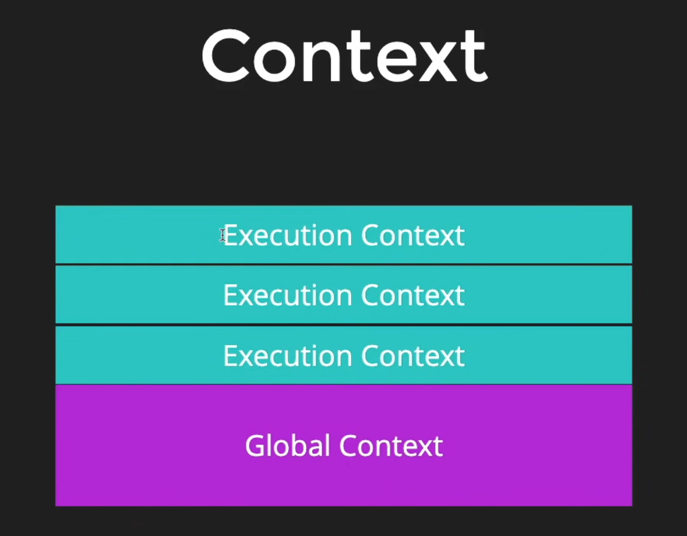
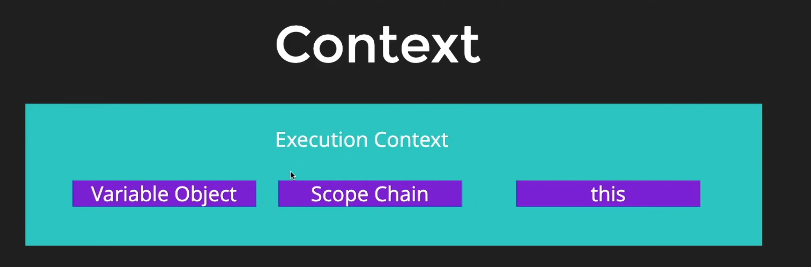
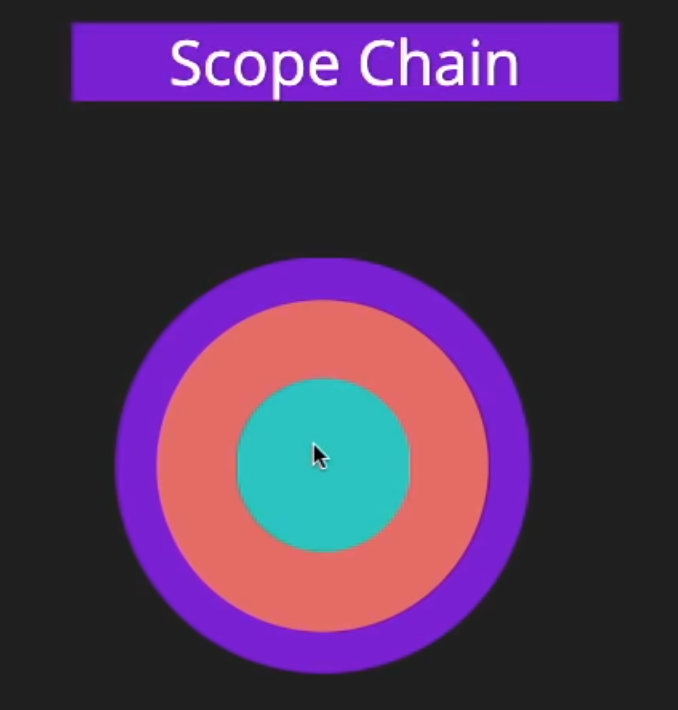
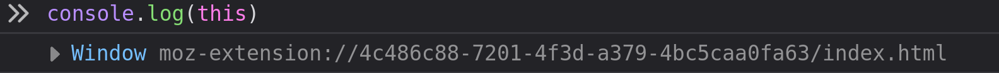
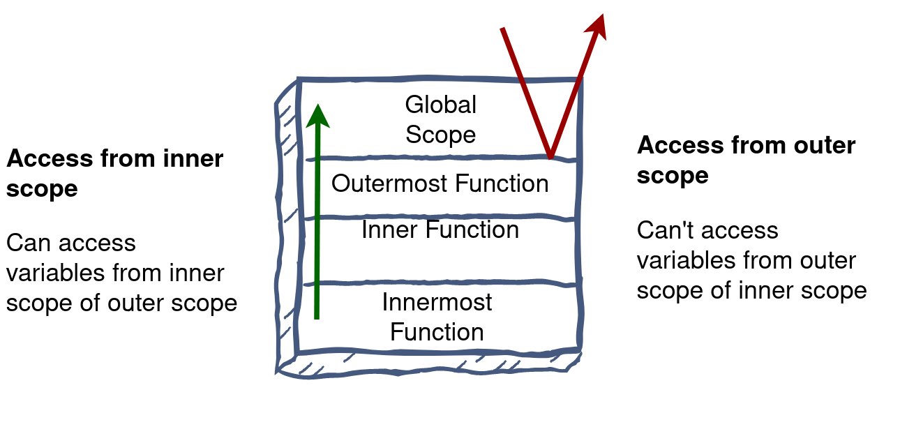

# Getting Started

JavaScript (JS) is a lightweight, interpreted, or [just-in-time](https://en.wikipedia.org/wiki/Just-in-time_compilation) compiled programming language with [first-class](https://developer.mozilla.org/en-US/docs/Glossary/First-class_Function) functions.

## JS Engine

The JavaScript engine is an interpreter that parses and executes a JavaScript program. e.g. V8 Engine, Spider Monkey

Javascript could only run in browsers before but now, things are changed runtime environment like Node.js, Deno can be used to run js without needing a browser.
Node.js uses V8 engine.

# Basics

A variable is a container for a value, like a number we might use in a sum, or a string that we might use as part of a sentence.

Variables can be declared using these keywords -

- var
- let
- const
  - constant can't be changed after declaration

Datatypes in JS -

- https://developer.mozilla.org/en-US/docs/Web/JavaScript/Reference/Operators/typeof

Operators in JS

- https://developer.mozilla.org/en-US/docs/Web/JavaScript/Reference/Operators/Operator_Precedence

### Conditionals

1. if..else
2. switch
3. ternary operator

### Expressions and Operators

https://developer.mozilla.org/en-US/docs/Web/JavaScript/Reference/Operators

### Coercion and truthy/falsy values

- Coercion is like implicit type conversion in javascript.
  - e.g. `2 + "2"` will return `22`
- Falsy Values (all values below are considered as falsy in JS)
  - `undefined`
  - `null`
  - `0`
  - `''`
  - `NaN`
- All values other than these are considered as truthy values

```js
// this code will not log anything
if (undefined) {
  console.log(true);
}
```

# Intermediate

## Functions

Functions in javascript can be declared by following syntax:

```js
function sayHello(name) {
  console.log("Hello there, ");
  console.log(`Hello there, ${name}`);
}

// Calling functions
// sayHello();

// Referencing a function
// sayHello;
```

Javascript is allows functional programming.

In functional programming, functions can be treated as variables.

```js
const greetings = namastey();

or;

const anotherOne = function () {
  return "something";
};

console.log(greetings());
```

## Context

Javascript have a concept of context.
And there is a global context.

Global Context

- In a Browser the global context is => `window`
- In a Node the global context is => something different than browser it shows `{}`

### Code Hoisting

Function and variable declarations are hoisted in JavaScript. This means that they are stored in memory of the current Execution Context and made available within the Execution Context even before the execution of the code begins.

Everything declared are registered in the context and thats why,
a function declared below call can be called before declaring in JS.

```js
tipper("5");

function tipper(a) {
  var bill = parseInt(a);
  console.log(bill + 5);
}
// this will work
// this is called CODE HOISTING
```

There are always two types of contexts

1. Global context
2. Context which is currently executing.

Execution Context ->
Whenever a function is called, the JavaScript engine creates a different type of Execution Context known as a Function Execution Context (FEC) within the GEC to evaluate and execute the code within that function.
Since every function call gets its own FEC, there can be more than one FEC in the run-time of a script.




Rules for execution context:

1. Function declarations are scanned and made available.
2. Variable declarations are scanned and made undefined.

### Scope Chain

😆 => Small guy can ask for icecream if he doesnt have from elder but elder cannot ask vice versa.



### `this` Keyword



```js
// THIS

// On a regular function call this always points towards window object.
// Regular function call means a like below

// sayMe(); // this is a regular function call

// user.say()  // is not regular function call

console.log(this);

const user = {
  firstName: "Ashwani Kumar",
  lastName: "Singh",
  role: "admin",
  loginCount: 32,
  facebookSignedIn: true,
  courseList: [],
  getCourseCount: function () {
    console.log("Line 21", this);

    function sayHello() {
      console.log("hello");
      console.log("Line 25", this);
    }
    // This is a regular function call so this will
    // point to global object / window object
    sayHello();
  },
};

user.getCourseCount();
```

## Arrays

[] - brackets

{} - braces

() - paranthesis

```js
// Declaration
var countries = ["India", "USA", "Japan"];

// this declaration can be useful
var states = new Array("Uttar Pradesh", "Rajasthan", "Assam");

// accessing elements
console.log(states[0]);

// update elements
states[0] = "Punjab";
console.log(states);
```

**We can insert different types of data in array**

```js
const user = ["Ashwani", "ashwani@dev.in", 21, 2, false];
// but this is not good practice for storing different data we,
// have seperate data structures for that.
```

**Some Usage**

```js
user.pop(); // remove last element

user.unshift("new value"); // add element at front
user.shift(); // remove element from front

console.log(user.indexOf(2));

console.log(Array.from("ashwani")); // pass any iteratable -> return array

// const result = [2, 4, 6, 8].every(isEven); // isEven is passed as a callback

// The every() method tests whether all elements in the array
// pass the test implemented by the provided function.
// It returns a Boolean value.

const result = [2, 3, 6, 8].every((element) => element % 2 == 0);

console.log(arr.fill("h", 1, 4));
// fill - fills array with static element with some range

const myNumber = [2, 3, 4, 1, 9, 6, 0, 8];

// fiter takes a callback
const result = myNumber.filter((num) => num !== 9);

// range => (firstValue, lastValue)
// firstValue is always inclusive
// lastValue is always exclusive

// ---------------------------------sliceandsplice-----------------------

const users = ["ash", "tom", "tim", "slkjf", "kfjkd", "rock", "john", "brock"];

console.log(users.slice(1, 3)); // returns slice of that range
console.log(users.slice(1));

users.splice(1, 3, "hi"); // removes elements in the range and puts given element there
```

## Objects

**Declaration**

```js
const user = {
  firstName: "Ashwani Kumar",
  lastName: "Singh",
  role: "admin",
  loginCount: 32,
  facebookSignedIn: true,
};
```

**Access**

```js
console.log(user.firstName);
console.log(user["lastName"]); // not used much
```

**Update**

```js
user.loginCount = 54;
```

**Function in Object**

```js
const user = {
  firstName: "Ashwani Kumar",
  lastName: "Singh",
  role: "admin",
  loginCount: 32,
  facebookSignedIn: true,
  courseList: [],
  // function in object
  buyCourse: function (courseName) {
    this.courseList.push(courseName);
  },
  getCourseCount: function () {
    return `${this.firstName} is enrolled in total of ${this.courseList.length} courses`;
  },
  getInfo: function () {
    return `
            ----------------- Info ---------------------
            Name: ${this.firstName + " " + this.lastName}
            Role: ${this.role}
            Login count: ${this.loginCount}
            Facebook Signed: ${this.facebookSignedIn}
            Total Courses taken: ${this.courseList.length}
        `;
  },
};

console.log(user.getCourseCount());
user.buyCourse("The React Bootcamp");
user.buyCourse("Javascript Course");
console.log(user.getCourseCount());
```

## Loops

for, while

```js
// FOR EACH LOOP
states.forEach((state, index) => {
  if (index === 1) {
    console.log(`State at ${index}st is ${state}`);
  } else if (index === 2) {
    console.log(`State at ${index}nd is ${state}`);
  } else {
    console.log(`State at ${index}th is ${state}`);
  }
});

// FOR OF LOOP
for (const state of states) {
  console.log(state);
}

// FOR IN LOOP
for (const key in states) {
  if (Object.hasOwnProperty.call(states, key)) {
    const element = states[key];
    console.log(element);
  }
}
```

# DOM

In my notebook.

# Advancish

## Objects - Prototypes

Another and preferrable way to declare an object

**Prototype**

Prototypes are used to create objects in functional programming, kind of smilar to classes

```js
// This is a prototype of an object
var User = function (firstName, couseCount) {
  this.firstName = firstName;
  this.couseCount = couseCount;
  this.getCourseCount = function () {
    console.log(`Course count is: ${this.courseCount}`);
  };
};
```

**proto of browser**

```js
// this is the proto which we saw in browser
// by proto we can add more functions, properties from outside of the object
User.prototype.getFirstName = function () {
  console.log(`Your firstname is: ${this.firstName}`);
};
```

**more**

```js
// By using new, we are saying this is not a regular function call
// we are creating a new memory space there we create this user and then give it
// to ashwani
var ashwani = new User("ashwani", 1);
console.log(ashwani);

var sam = new User("sam", 3);
console.log(sam);

// this is a regular function call thats why this will point to window object/global
var hitesh = User("hitesh", 100);
console.log(hitesh);
```


